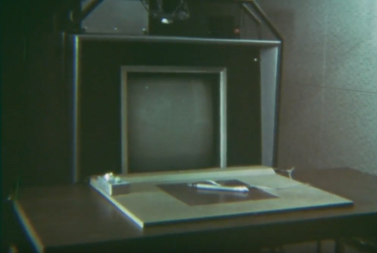
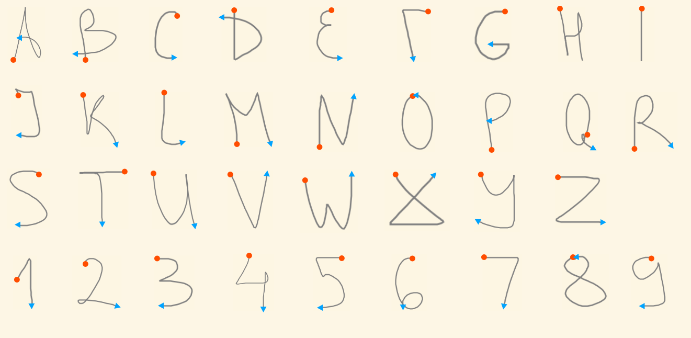

# Symbol Recognition

## Table Of Contents
 
* [About](#about)
* [How to run it](#how-to-run-it)
* [How to use it](#how-to-use-it)
* [Dependencies](#dependencies)
* [TODO](#todo)
* [Issues](#issues)

## About

The **Symbol Recognition** project is Web app written in Elm. 
You can handwrite symbols (the letters from A-Z and numbers 1-9) on
the canvas and get it recognized. Second point of the project is to use the time-sequenced
 symbol recognition for gesture navigation UI .The project is inspired by one of the most 
productive studies in HCI - The [GRAIL/BIOMOD system](https://www.youtube.com/watch?v=2Cq8S3jzJiQ).



The [text recognition scheme (_Real-Time Recognition of Handprinted Text_, 1966)](https://www.rand.org/pubs/research_memoranda/RM5016.html) was designed and implemented mainly by Garbriel F. Groner to permit an on-line computer user 
to print text naturally and have it recognized accurately. The original scheme was able to recognize a set of
53 symbols entered with the help of the RAND tablet with its pen as input device.
Recognition of the symbols was done as analysis of the data in a time-sequenced matter, 
with a series of test to identify a specific symbol:

<br>

#### 1) Getting Raw Data
        
Originally, pressing the pen against the tablet  surface activated
the symbol recognition scheme by indicating the start of a stroke.
As the pen was moved data-points were added to the stroke. And finally 
when the pen was lifted the recognition scheme was notified that the 
stroke is complete. Next is the series of data analysis of the stroke.

#### 2) Smoothing 

As taken from _Real-Time Recognition of Handprinted Text (Groner, 1966)_ :

"The scheme smooths the data by averaging a newly arrived data-point with the 
previously smoothed data-point, thus reducing the noise due to discreteness of the pen
location as measured by the tablet. Smoothing is based on the equations"


#### 3) Thinning

"Thinning is the process of removing some of the data-points from the pen track.
This is accomplished by comparing the position of a new smoothed data-point with the
position of the last point in a thinned track. If these points are sufficiently apart,
the analysis scheme accepts the smoothed points as part of the thinned track; otherwise, 
it is discarded. Thinning eliminates small perturbation in the track, and reduces 
the data processing requirements by drastically reducing (by a factor of seven or so) 
the number of data-points."
          
          
#### 4) Curvature

This test assigned a *direction* to each point so the stroke/symbol can be represented by 
a sequence of directions - eg. UP, DOWN, UP, LEFT which results in the letter A. 

"If the same direction occurs twice in succession, and it is not the same as the last 
direction listed in the sequence, then it is added to the list; otherwise it is discarded." 


#### 5) Corner Detection

A corner is detected whenever the pen is moves in the same direction for at least 
two segments, changes direction by at least 90°, and 
then proceeds along the new direction for at least two segments.

#### 6) Additional features (Partially implemented, but not used yet)

In this implementation the Start and End positions of a stroke are stored for
further testing in the decision process of the recognition.

Additional features were used in the original, such as the size, position and ratio of the stroke.


## How to run it

#### [Open the Link](https://andyfv.github.io/symbol-recognition/)

<br>

```Or download/clone locally:```

1) Download or Clone the repository
2) Open index.html in a browser


## How to use it

On the page you will see three Boxes:

* Raw Input 
* Smoothed Input
* Thinned Input 

Just draw/write a stroke in one of the boxes (it doesn't matter which one).
Below is the table of the symbols and their single-stroke representation.



***

## Dependencies

* mdgriffith/elm-ui
* elm/svg


## TODO

There is much to be done: 

* Fix issue in Firefox where the cursor is constantly jumping to top-left of the canvas  
* The code is not taking full advantage of the Elm features - some "shortcuts" need to be fixed
* Making the experience more interactive
* Migrating from elm/svg to elm-vizualization
* Add more symbols by implementing more recognition features

## Issues

* In Firefox the cursor is constantly jumping to top-left of the canvas.